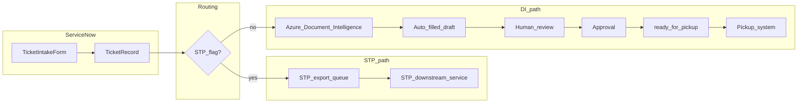

# Architecture

Hybrid ticket processing: ServiceNow holds workflow state, attachments, and human tasks; external systems handle STP export, Azure Document Intelligence, and pickup consumption.

## High-level flow



## Status model (planned)

| Status | Meaning |
|--------|---------|
| `submitted` | Ticket created via intake form |
| `stp_queued` | Flagged STP; waiting for downstream pull |
| `di_processing` | Sent to Azure DI for extraction |
| `pending_review` | Draft form ready for human review |
| `approved` | Human approved after review |
| `ready_for_pickup` | Approved and available for pickup system |
| `picked_up` | External pickup consumer acknowledged |

Typical transitions:

- STP path: `submitted` → `stp_queued` → (external) → `picked_up`
- DI path: `submitted` → `di_processing` → `pending_review` → `approved` → `ready_for_pickup` → `picked_up`

## Integration boundaries

| System | Responsibility |
|--------|----------------|
| ServiceNow | Ticket records, attachments, ACLs, UI (React), review/approval tasks |
| STP downstream service | Poll or receive tickets flagged STP; consumes **StpTicketExport** shape |
| Azure Document Intelligence | OCR / layout analysis on uploaded documents; returns fields for auto-fill |
| Pickup system | Polls tickets in `ready_for_pickup`; consumes **DiTicketExport** shape (DI path) |

## Export payload shapes (planned TypeScript types)

The two paths use **different payloads** so consumers do not share one schema.

### StpTicketExport (straight-through)

Minimal, pre-classified tickets — no review payload.

```typescript
// Illustrative — not implemented yet
type StpTicketExport = {
    ticket_sys_id: string
    external_id: string
    submitted_at: string
    stp_flag: true
    // STP-specific fields TBD
}
```

### DiTicketExport (document intelligence + review)

Richer shape after extraction, review, and approval.

```typescript
// Illustrative — not implemented yet
type DiTicketExport = {
    ticket_sys_id: string
    external_id: string
    submitted_at: string
    approved_at: string
    stp_flag: false
    extracted_fields: Record<string, string>
    attachment_refs: string[]
    // DI-specific fields TBD
}
```

## Client stack

- **React 19 + TypeScript** (`src/client/*.tsx`)
- **Tailwind CSS v4** for styling
- **ServiceNow Table API** for CRUD (future phases)
- **Fluent SDK** for tables, ACLs, business rules, UI page metadata

## Implementation phases

| Phase | Scope |
|-------|--------|
| 1 | Clean slate — shell UI, no ticket features |
| 2 (current) | Ticket table, ACLs, portal home + submit UI pages, intake form, file upload |
| 3 | `stp_flag` / `processing_path`, status fields, typed models |
| 4 | Integration stubs (Scripted REST / Flow) for STP and Azure DI |
| 5 | Review/approval UI, `ready_for_pickup`, export APIs |
